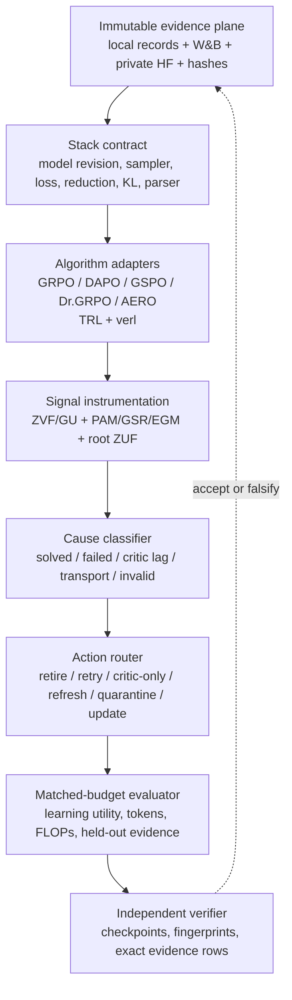

# Breakthrough Chase: Architecture and Algorithmic Novelty Across 18 Artifacts

**Audit date:** 2026-07-20

**Scope:** P01--P08, R01--R08, U01, and N01

**Verdict standard:** novelty is credited to an underlying mechanism, system, or
test architecture only once. Venue variants, condensed statements, and the
umbrella compendium are not independent evidence or independent inventions.

## Executive verdict

The program does not contain 18 independent breakthroughs. It contains five
overlapping technical systems, of which two are plausible flagship cores:

1. **Executed methodological core: evidence-carrying treatment survival.**
   R08, P05/P06, R06/R07, and the new two-stack differential harness form an
   unusually rigorous architecture for separating an algorithmic treatment
   from its trainer, sampler, reduction, checkpoint, and evaluation stack. The
   40-unit E1 audit is complete, and the TRL/verl differential gate is
   hash-bound and passing. This is the strongest contribution that is true
   today. It is reproducibility and experimental-systems novelty, not a new RL
   optimizer.
2. **Highest-upside algorithmic core: root-level signal survival plus
   cause-aware routing.** N01 factors actor credit into Potential Advantage
   Mass (PAM), Gradient Survival Ratio (GSR), Effective Gradient Mass (EGM),
   and root-level Zero-Update Fraction (ZUF), then routes distinct failure
   causes through TRIAGE-RL. The distinctiveness is the *composition*: one
   coefficient ledger across GRPO, PPO, and asynchronous SAO; root-trajectory
   aggregation; and different actions for failed starvation, solved
   saturation, critic lag, transport starvation, and invalid reward. The
   formulas and instrumentation exist, but the controller is not yet executed
   in the preregistered PPO/SAO campaign. This is a strong hypothesis, not a
   result.

The broadest tempting claims do not survive the chase:

- ZVF alone is not a 2026 category-creating metric. Contemporaneous work
  measures zero-variance groups, advantage collapse, or equivalent sparse
  reward conditions.
- Adaptive group size or adaptive rollout count is not unique. AR3PO, CERO,
  Goldilocks, AVSPO, F-GRPO, and related methods already adapt sampling,
  difficulty, advantage weighting, or collapsed groups.
- The legacy reward-only `ZVFController` is not the flagship algorithm. Its
  symmetric high-ZVF response is exactly the behavior undermined by the
  92.3% all-correct escalation audit. It belongs in the comparison set as a
  naive baseline.
- P01, P03, and P04 provide useful negative or bounded empirical results, not
  standalone algorithmic inventions.
- P8 is a separate cross-domain measurement study and should remain outside
  the RL flagship.

## One coherent architecture hidden inside the 18 documents



This architecture is stronger than any single manuscript. P05/P06 and R06/R07
define the evidence and stack contracts. R08 and S1 verify that the declared
treatment is actually implemented. P02/R05 provide a narrow sensor. N01
generalizes the sensor to post-gate actor credit and proposes the action router.
The remaining papers supply bounded empirical cases, benchmark context, or
venue packaging.

## Novelty rubric

- **Executed:** implementation and external evidence satisfy the declared
  acceptance contract.
- **Implemented:** code and tests exist, but the decisive learning experiment
  has not run.
- **Proposed:** paper specification exists; no matching treatment outcome.
- **Derivative:** repackages another artifact's evidence or prose.
- **Parked:** outside the flagship scope.

“Algorithmic novelty” is reserved for a new update, allocation, routing, or
control rule. Diagnostics, audits, schemas, and benchmarks may be valuable
architecture contributions without being new learning algorithms.

## Artifact-by-artifact verdict

| ID | Architectural role | Algorithmic or systems novelty | Maturity | Breakthrough-chase decision |
|---|---|---|---|---|
| **P01** | Cross-scale identifiability and collapse audit | No new optimizer. The defensible contribution is falsifying an estimable universal GRPO scaling law on this corpus and exposing the Nemotron collapse as a separate phase. | Bounded empirical | Keep as thesis evidence and a negative-results donor; not a flagship algorithm. |
| **P02** | Mechanical GRPO starvation sensor | ZVF is the frequency of flat reward groups, with exact binary identity `pass@G - p^G = 1 - ZVF`. The accounting is useful but algebraically simple and now close to active prior art. | Executed diagnostic | Keep as the sensor layer; remove any “first diagnostic” framing. |
| **P03** | Group-size/cost study | The conditional `(1-ZVF)/sqrt(G)` utility and matched-token G2/G16 panel are useful, but the optimum is objective- and cohort-specific. Reconstructed G32 is not algorithmic evidence. | Mixed direct/reconstructed | Donate the matched-token panel; require a direct multi-seed sweep before any control claim. |
| **P04** | Length-normalization boundary test | No new method. It bounds where GRPO and Dr.GRPO are indistinguishable under a 200-token cap. | Bounded empirical | Keep as a falsification/boundary chapter, not a main-track novelty claim. |
| **P05** | Minimum reportable stack contract | The 7+1 reporting standard turns hidden trainer choices into a declared experimental treatment. This is methodological architecture. | Implemented/evidence-backed | Merge into the survival-artifact contribution; avoid a separate algorithm paper. |
| **P06** | Machine-readable stack and variant registry | Structured variant deltas and provenance make algorithm labels queryable. Systems novelty is credible; current external completeness/adoption is limited. | Implemented, partial population | Ship as artifact infrastructure with P05/R08, not as a standalone scientific breakthrough. |
| **P07** | Retrospective controller audit and adaptive-G proposal | The main original insight is negative: high ZVF aliases all-correct and all-wrong states, so symmetric escalation is wrong. The proposed control family overlaps adaptive rollout prior art and lacks the matched-budget bakeoff. | Proposed/retrospective | Retire the legacy controller to a baseline; move semantic asymmetry into N01. |
| **P08** | Fraud sensor/scribe side study | Proposed hybrid architecture; no measured hybrid benefit and no RL contribution. | Parked | Exclude from the flagship. Preserve as a separate measurement case study. |
| **R01** | Compact cross-library venue paper | No independent method; compresses benchmark and stack claims. | Derivative | Do not count as novelty. Regenerate only for a specific venue. |
| **R02** | Focused ZVF sentinel/stratification paper | Clearer venue framing than P02, but recent zero-variance and advantage-collapse work narrows novelty to the exact accounting and stratified audit discipline. | Executed diagnostic, derivative evidence | Viable workshop/short paper only if positioned against 2026 prior art. |
| **R03** | Exploratory benchmark note | No independent algorithm. | Derivative | Retire after extracting artifact instructions. |
| **R04** | Evidence-tiered benchmark artifact | Reproducibility architecture is useful, but scientific claims reuse P-series evidence. | Implemented artifact | Candidate artifact-track companion, not the main novelty. |
| **R05** | ZVF calibration and reliability theory | Binomial calibration and rollout-to-informative-group budgets are correct and useful. The proved proxy optimum ties at G2/G3, so the theory explicitly fails to identify an adaptive set-point. | Proved conditional theory | Keep as calibration/limits, not controller justification. |
| **R06** | Condensed stack-reporting position | No independent technical contribution beyond P05. | Derivative | Merge/retire after extracting concise policy language. |
| **R07** | Condensed living registry | No independent technical contribution beyond P06. | Derivative | Merge into the released registry documentation. |
| **R08** | Single-stack treatment-survival protocol | Strongest current architecture: shared stack, declared overrides, preregistered verdicts, complete remote evidence, and independent reconciliation. DAPO disappears; the other variants remain inconclusive. | Executed | Core of the publishable artifact/methodology contribution. Keep the single-stack boundary explicit. |
| **U01** | 239-page evidence compendium | No independent method; high reuse and historical residue. | Archive/derivative | Freeze as internal source archive. Never route as a venue manuscript. |
| **N01** | Cross-algorithm signal-survival formalism and TRIAGE-RL | PAM/GSR/EGM/root-ZUF plus cause-specific root routing is the most distinctive algorithmic composition. The zero-update implication is exact; positive EGM is only a proxy. No PPO/SAO controller outcome exists yet. | Implemented instrumentation; proposed controller | Highest-upside flagship core, contingent on the preregistered matched-budget campaign. |

## Breakthrough ranking

### Tier A — defensible now: evidence-carrying treatment survival

**Composition:** P05 + P06 + R08 + S1 differential harness + immutable campaign
verifier.

Why it is differentiated:

- It treats the algorithm label as a hypothesis to verify, not trusted metadata.
- Intended GRPO/DAPO/GSPO/Dr.GRPO/AERO semantics are checked against a
  canonical float64 reference on two open stacks.
- Native-stack deviations are retained as `MATERIAL_DIFFERENCE` or
  `NOT_TESTED`; they are not normalized away.
- Every accepted unit binds the plan, corpus, source hashes, W&B run, private
  HF commit, checkpoint manifests, final adapter, and held-out evidence hashes.
- The completed E1 audit gives a concrete scientific result: DAPO's reported
  gain disappears on the frozen shared stack; the other arms are
  inconclusive rather than falsely declared equivalent.

The novelty is a **treatment-verification architecture** for RL post-training.
It is strongest as an artifact, benchmark methodology, or reproducibility
paper. It should not be marketed as a new policy-gradient algorithm.

### Tier A-high-risk — potential flagship: root-level signal survival and TRIAGE-RL

**Composition:** N01 + `platform_hybrid/experiments/signal_starvation` + the
preregistered PPO/SAO campaign.

The candidate algorithm has four layers:

1. **Generated credit:** PAM measures squared pre-gate coefficient mass.
2. **Transport survival:** GSR measures the fraction surviving the algorithm's
   trust-region or off-policy gate.
3. **Effective mass:** `EGM = PAM * GSR`; EGM=0 certifies a zero
   reward-conditioned score-function update, while EGM>0 does not guarantee a
   useful gradient.
4. **Semantic routing:** root trajectories are classified and sent to distinct
   actions: bounded retry, solved retirement/distillation, critic-only repair,
   fresh-policy recollection, invalid/hack quarantine, or ordinary update.

The implementation already validates coefficient factorization, action-token
masking, and root aggregation invariance. The paper also specifies a geometry
audit (GUN), propensity logging, a base-stream probability floor, capped
retries, and separate critic/actor control.

What is not yet proven:

- EGM adds out-of-sample prediction of gradient-update norm beyond reward,
  advantage variance, and clip fraction.
- Cause-aware routing improves held-out success per generated action token.
- Fresh-policy recollection beats wider clipping for high-PAM/low-GSR roots.
- Root routing avoids chunk-count selection bias in agentic trajectories.

Until those pass, call this a **controller proposal with executable
instrumentation**, not an algorithmic result.

### Tier B — useful supporting innovations

- **R05 calibration/reliability budgets:** rigorous sensor calibration and a
  valuable negative theorem about the insufficiency of the declared proxy
  objective.
- **P03 matched-token panel:** strong empirical motivation for a budget-aware
  controller, without identifying one.
- **P05/P06 schemas:** useful research infrastructure that makes R08 and N01
  auditable.
- **P01/P04 negative results:** protect the flagship against universal scaling,
  group-size, and length-bias overclaims.

### Tier C/D — packaging, archive, or unrelated

R01--R04 and R06--R07 are venue or scope derivatives. U01 is an archive. P08
is outside the RL thesis. They should not increase the novelty count.

## Closest prior art and collision analysis

| Prior work | What it already claims | Collision with this program | Remaining defensible edge |
|---|---|---|---|
| [Goldilocks RL](https://arxiv.org/abs/2602.14868) | Teacher-driven difficulty sampling to avoid too-easy/too-hard sparse-reward tasks; reports zero-variance fraction | P02/P07 cannot claim first recognition that flat groups waste updates or first adaptive difficulty response | Exact ZVF accounting; separation of solved vs failed starvation; post-gate cross-algorithm ledger |
| [AR3PO](https://arxiv.org/abs/2509.25808) | Adaptive rollout count and response reuse; reports rollout-cost reductions | Direct collision with adaptive-G/rollout-efficiency headlines | Root-level cause semantics, critic/transport routes, and propensity-audited action ontology |
| [Advantage Collapse / AVSPO](https://arxiv.org/abs/2605.21125) | Advantage Collapse Rate and virtual samples to repair homogeneous groups | Strong collision with ZVF-as-new-diagnostic and collapsed-group repair | ZVF's exact binary identity; refusing one repair for opposite boundary states; multi-algorithm transport accounting |
| [REFT](https://arxiv.org/abs/2605.28295) | First-token diversification reduces all-wrong groups | Collision with generic “increase diversity when starved” claims | TRIAGE-RL can choose diversification/retry only for failed starvation and retire solved roots |
| [F-GRPO](https://arxiv.org/abs/2602.06717) | Difficulty-aware advantage scaling downweights obvious prompts | Collision with solved-example downweighting | Separate data actions from actor/critic/gate actions and verify each under one budget ledger |
| [CERO](https://arxiv.org/abs/2606.05606) | Global cross-epoch adaptive rollout allocation | Collision with rollout allocation as the central novelty | Downstream classification of why actor credit failed and routing beyond rollout count |
| [BASIS](https://arxiv.org/abs/2605.27293) | Single-rollout advantage estimation via batchwise information sharing | Collision with single-rollout efficiency claims | EGM/GSR are agnostic to how the advantage was estimated and audit whether it survives gating |
| [SAO](https://arxiv.org/abs/2607.07508) | Asynchronous single-rollout optimization with critic design and strict off-policy masking | N01 must not claim the asynchronous optimizer or mask | Treat masked high-advantage roots as transport starvation and trigger recollection/lag repair without weakening SAO |
| [DVAO](https://arxiv.org/abs/2605.25604) | Variance-adaptive multi-reward weighting | Collision with broad “variance-adaptive optimization” language | This program addresses actor-credit survival and route selection, not multi-objective reward weighting |

These are recent preprints. They narrow priority claims but do not by
themselves establish whether TRIAGE-RL's full composition is novel. A formal
related-work pass should inspect revisions and code before submission.

## The key architectural correction

The program currently contains two controllers that should not be conflated:

1. **Legacy `ZVFController`:** consumes reward groups, computes ZVF/GU and
   mean reward, adapts G, drops repeated zero-variance prompts, and can stop a
   collapse. This is a useful baseline but a poor flagship: its group-size rule
   is fundamentally ZVF-driven, while the audit shows most high-ZVF events are
   solved/all-correct.
2. **TRIAGE-RL:** consumes root-level ratios, advantages, gates, critic
   diagnostics, outcomes, and validity signals. It changes different resources
   for different causes. This is the real architecture to validate.

The legacy controller should become the preregistered **naive symmetric** arm,
not the implementation of the full-triage arm.

## Recommended flagship consolidation

### Working thesis

> RL post-training fails not only when reward is absent, but when generated
> credit cannot survive the estimator, transport gate, or evidence pipeline.
> An update should be treated as an evidence-carrying treatment whose signal
> mass, cause of loss, action, and implementation are independently verifiable.

### Recommended paper architecture

1. **Problem:** rollout/token budgets overcount updates that cannot teach.
2. **Measurement:** PAM/GSR/EGM/root-ZUF with the exact zero-update
   certificate and explicit non-converse.
3. **Semantics:** identical low-signal observations can require opposite
   actions; distinguish solved, failed, critic-lagged, transport-starved, and
   invalid roots.
4. **Controller:** TRIAGE-RL with bounded actions, propensity logging, and
   base-stream protection.
5. **Treatment verification:** S1 differential tests prove what each algorithm
   arm executes on TRL and verl.
6. **Prospective evidence:** matched-budget screening, then confirmatory
   expansion only after the frozen gate passes.
7. **Limits:** ZVF is not a causal predictor; EGM is not an improvement
   guarantee; single-stack E1 does not establish universal algorithm rankings.

This combines the strongest executed architecture with the strongest
algorithmic hypothesis. The paper should not be presented as “18 papers
combined”; it is one mechanism-and-verification paper with supporting artifacts.

## Falsifiers and kill criteria

The breakthrough claim should be killed or narrowed if any of these occur:

1. **Metric kill:** EGM does not improve paired out-of-sample prediction of
   sampled gradient-update norm over reward, raw advantage variance, and clip
   fraction.
2. **Semantic kill:** the solved/failed/critic/transport classifier is not
   stable under frozen thresholds or cannot be calibrated on held-out roots.
3. **Controller kill:** full triage fails to improve held-out success per
   generated action token over static, symmetric, failure-only, and
   boundary-aware baselines.
4. **Transport kill:** fresh-policy recollection does not beat widened clipping
   at matched generated tokens for high-PAM/low-GSR roots.
5. **External-validity kill:** the effect does not reproduce across the two
   frozen multimodal agent candidates and the complete 16-domain Pavlov's List
   task contract. GSM8K is calibration-only and cannot satisfy this gate.
6. **Treatment kill:** objective-differential receipts or immutable run
   evidence disagree with the declared arm.

The confirmatory matrix must not run after a failed screening gate.

## Immediate research priorities

1. Finish the already-preregistered flagship screening campaign once A100
   capacity returns. Do not substitute hardware or weaken the gate.
2. Integrate PAM/GSR/EGM logging into the exact screening trainer so every arm
   emits root-level signal receipts.
3. Implement the five controller arms with the legacy `ZVFController` mapped
   explicitly to the naive symmetric arm and TRIAGE-RL mapped to full triage.
4. Add a frozen threshold-calibration split and a classifier-confusion audit.
5. Treat R08/S1 as the experimental validity layer of the same paper, not a
   separate universal algorithm-ranking claim.
6. Merge or retire venue derivatives after preserving unique prose and build
   instructions.

## Evidence used

Internal authoritative surfaces:

- `platform_hybrid/paper/PAPERS_README.md`
- `autoresearch/improve-260714-1806/PROGRAM_AUDIT.md`
- `autoresearch/improve-260714-1806/OBLIGATIONS.md`
- `autoresearch/improve-260714-1806/inventory.tsv`
- `autoresearch/improve-260714-1806/similarity.tsv`
- `autoresearch/improve-260714-1806/SELF_REVIEW_FLAGS.md`
- `platform_hybrid/experiments/results/claim_to_run/claim_to_run_table.tsv`
- `zvf-program/audit/results/audit.json`
- `zvf-program/flagship/s1/results/implementation_freeze.json`
- `platform_hybrid/experiments/signal_starvation/preregistration.json`
- `platform_hybrid/experiments/signal_starvation/metrics.py`
- `zvf-program/zvf-triage/src/zvf_triage/controller.py`
- `zvf-program/flagship/pilot/verifier.py`

Corpus integrity at the starting point: 18 canonical roots, 328 unique included
source files, all roots compiling, and explicit derivative/evidence-reuse
boundaries. The current R08 aggregate is `COMPLETE` with eight paired seeds:
DAPO `DISAPPEARS`; GSPO, Dr.GRPO, and AERO `INCONCLUSIVE`.
**(Superseded 2026-08-02: all four arms are `INCONCLUSIVE` under the corrected
exact-t analysis — see `zvf-program/audit/STATISTICAL_REANALYSIS.md`.)**

## Rerun inputs

```text
workflow: firecrawl-research-papers
topic: zero-update diagnostics, adaptive rollout allocation, advantage collapse,
       and cause-aware routing across GRPO, PPO, and asynchronous agentic RL
target_count: 9 primary papers
output: markdown breakthrough-chase audit
internal_roster: P01-P08, R01-R08, U01, N01
prior_art_snapshot: 2026-07-20
```
